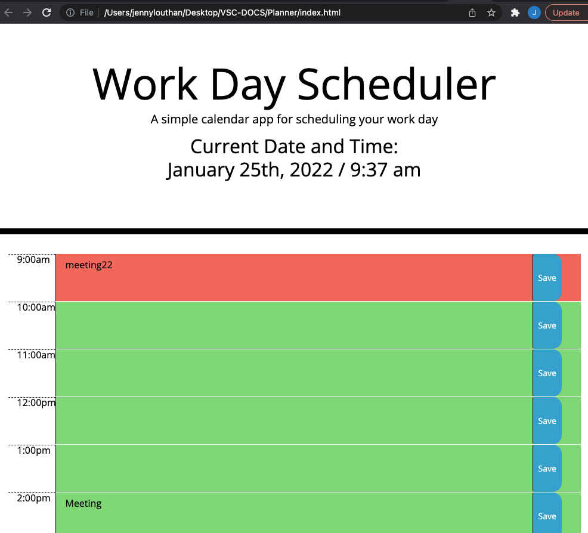

# Event Planner
## <Project Event Planner>

## Table of Contents 

* [Description](#description)

* [LinkToSite](#LinkToSite)

* [Questions](#questions)

## Description

In this project we were tasked with making an event planner for a busy user. We were given the start of the HTML and the CSS files. Our challenge was to make this planner using third party API's that we've recently been learning. Based on the screenshot we were also given, I chose to use Bootstrap, Moment, and JQuery. I followed the CSS which helped outline the timeblocks and buttons needed in the HTML. The most challenging part was the javascript file and utilizing local storage to save the text information when the 'save' button is clicked. 

## LinkToSite
<link to the live site here>

## Questions

If you have any questions about the repo, open an issue or contact [jenny](undefined) directly at jennyrae818@gmail.com.